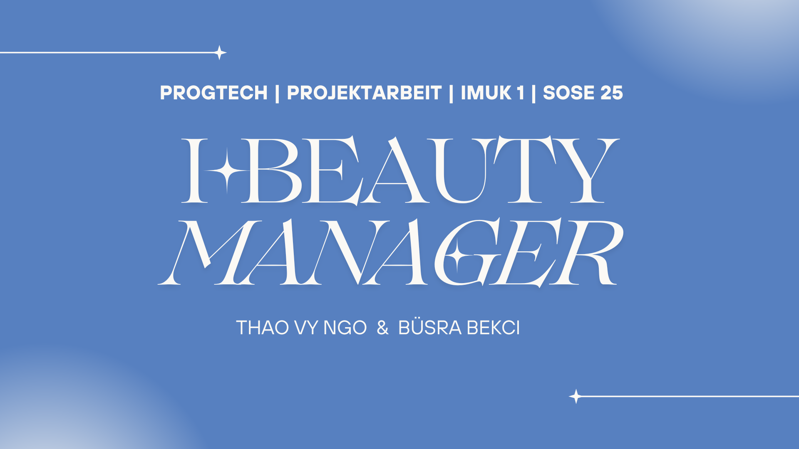

# 💅 iBeauty Manager  
**Terminverwaltung für Pflege- und Schönheitsdienste**

---

## Projektbeschreibung

**iBeauty Manager** ist eine Java-Swing-Anwendung, die speziell für Beautystudios oder selbstständigen Kosmetiker:innen entwickelt wurde.
Die Anwendung unterstützt die Verwaltung von Terminen für Schönheitsbehandlungen wie Massage, Nägel und Kosmetik. 

Hier ist die Liste der verwendeten Dienste und Angebote aus unserem Programm:


*(basierend auf echte Daten aus der Menüleiste der Treatwell-Website.)*

**iBeauty Manager** bietet eine benutzerfreundliche Oberfläche und ermöglicht:
- Erstellung und Anzeige von Terminen in Tabellenform *(mit TableMode)*
- Filterung von Terminen nach Telefonnummer und Kundennamen  
- Berechnung des Gesamtpreises basierend auf gewähltem Dienst und Angebot  
- Auswahl von Datum und Uhrzeit für den Termin *(mit JCalendar)*

---

## Installation

**Systemanforderungen**

IntelliJ IDEA *(aktuelle Version mit Java-24-Unterstützung)*

**Installationsschritte**

Projekt von GitHub klonen:

```bash
git clone https://github.com/thaovyngo11/iBeautyManager.git
cd iBeautyManager
```

---

## Anwendung starten

- Öffnen die Datei `Main.java` in IntelliJ IDEA.
- Rechtsklicken auf die Datei → **Run 'Main'** auswählen.

---

## Unser Video 

[](https://vimeo.com/1096825142/3e5653cadb?share=copy)

---

## UML-Diagramme


---

## Über unser Team

Wir, die **Gruppe 20**, bestehen aus **Thao Vy Ngo** und **Büsra Bekci**, sind IMUK-Studierende im 1. Semester an der Hochschule Neu-Ulm.
Die Java-Swing-Anwendung, **iBeauty Manager** wurde im Rahmen der Projektarbeit im Modul Programmiertechnik entwickelt.

**Bearbeitungszeitraum:** 

Diese Projektarbeit wurde zwischen dem 31.05.2025 und dem 25.06.2025 durchgeführt.

**Ideenfindung & Motivation:**  

Als moderne junge Frauen haben wir großes Interesse an Schönheits- und Pflegediensten. Wenn Sie selbst regelmäßiger Gast in einem Beauty-Salon sind, kennen Sie sicher das Terminbuchen und die Vielfalt an Angeboten.

Doch anstatt eine Anwendung für Kunden zu entwickeln, haben wir uns – basierend auf der Aufgabenstellung – für eine andere Perspektive entschieden:
Wir wollten eine Java-Anwendung mit Benutzeroberflächer für Anbieter und Salonbetreiber entwerfen.

So entstand unser Projekt: **iBeauty Manager**.

